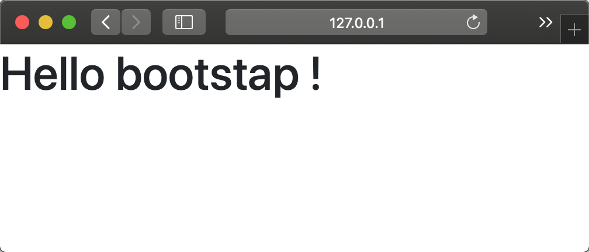

[TOC]

## bootstrap 是什么
   bootstrap 是一个前端框架，暂时可以把它看成是一系列 css 样式的集合

   ---

## 在项目中使用 bootstrap 
   这里介绍使用 CDN 的方式来引入 bootstrap
   ```html
   <!DOCTYPE html>
   <html>
   
   <head>
       <!-- meta-->
       <meta charset="utf-8">
       <meta name="viewport" content="width=device-width, initial-scale=1, shrink-to-fit=no">
       <meta http-equiv="x-ua-compatible" content="ie=edge">
       <!-- bootstrap css-->
       <link rel="stylesheet" href="https://stackpath.bootstrapcdn.com/bootstrap/4.4.1/css/bootstrap.min.css"
           integrity="sha384-Vkoo8x4CGsO3+Hhxv8T/Q5PaXtkKtu6ug5TOeNV6gBiFeWPGFN9MuhOf23Q9Ifjh" crossorigin="anonymous">
   
       <title>Hello, bootstrap!</title>
   </head>

   <body>
   
       <h1>Hello bootstap !</h1>
   
       <!-- boostrap 依赖于 jquery 和 popper 所以要先引入他们-->
       <script src="https://code.jquery.com/jquery-3.4.1.slim.min.js"
           integrity="sha384-J6qa4849blE2+poT4WnyKhv5vZF5SrPo0iEjwBvKU7imGFAV0wwj1yYfoRSJoZ+n"
           crossorigin="anonymous"></script>
       <script src="https://cdn.jsdelivr.net/npm/popper.js@1.16.0/dist/umd/popper.min.js"
           integrity="sha384-Q6E9RHvbIyZFJoft+2mJbHaEWldlvI9IOYy5n3zV9zzTtmI3UksdQRVvoxMfooAo"
           crossorigin="anonymous"></script>
       <script src="https://stackpath.bootstrapcdn.com/bootstrap/4.4.1/js/bootstrap.min.js"
           integrity="sha384-wfSDF2E50Y2D1uUdj0O3uMBJnjuUD4Ih7YwaYd1iqfktj0Uod8GCExl3Og8ifwB6"
           crossorigin="anonymous"></script>
   </body>
   
   </html>
   ```
   在浏览器中看到的效果

   


   ---

## 给页面加上一个简单的导航
   ```html
   <!DOCTYPE html>
   <html>
   
   <head>
       <!-- meta-->
       <meta charset="utf-8">
       <meta name="viewport" content="width=device-width, initial-scale=1, shrink-to-fit=no">
       <meta http-equiv="x-ua-compatible" content="ie=edge">
       <!-- bootstrap css-->
       <link rel="stylesheet" href="https://stackpath.bootstrapcdn.com/bootstrap/4.4.1/css/bootstrap.min.css"
           integrity="sha384-Vkoo8x4CGsO3+Hhxv8T/Q5PaXtkKtu6ug5TOeNV6gBiFeWPGFN9MuhOf23Q9Ifjh" crossorigin="anonymous">
   
       <title>Hello, bootstrap!</title>
   </head>

   <body>
       <header role="banner">
           <nav class="navbar navbar-light bg-light" role="navigation">
               <a class="navbar-brand" href="#">Navbar</a>
               <ul class="nav nvabar-nav">
                   <li class="nav-item">
                       <a class="nav-link active" href="#">Home<span class="sr-only">(current)</span></a>
                   </li>
                   <li class="nav-item">
                       <a class="nav-link" href="#">Features</a>
                   </li>
                   <li class="nav-item">
                       <a class="nav-link" href="#">Pricing</a>
                   </li>
                   <li class="nav-item">
                       <a class="nav-link" href="#">About</a>
                   </li>
   
               </ul>
           </nav>
       </header>
       <h1>Hello bootstap !</h1>
   
       <script src="https://code.jquery.com/jquery-3.4.1.slim.min.js"
           integrity="sha384-J6qa4849blE2+poT4WnyKhv5vZF5SrPo0iEjwBvKU7imGFAV0wwj1yYfoRSJoZ+n"
           crossorigin="anonymous"></script>
       <script src="https://cdn.jsdelivr.net/npm/popper.js@1.16.0/dist/umd/popper.min.js"
           integrity="sha384-Q6E9RHvbIyZFJoft+2mJbHaEWldlvI9IOYy5n3zV9zzTtmI3UksdQRVvoxMfooAo"
           crossorigin="anonymous"></script>
       <script src="https://stackpath.bootstrapcdn.com/bootstrap/4.4.1/js/bootstrap.min.js"
           integrity="sha384-wfSDF2E50Y2D1uUdj0O3uMBJnjuUD4Ih7YwaYd1iqfktj0Uod8GCExl3Og8ifwB6"
           crossorigin="anonymous"></script>
   </body>
   
   </html>
   ```
   效果如下
   

   上面例子中使用到的 css 汇总
   ```css
.navbar {
    position: relative;
    display: -ms-flexbox;
    display: flex;
    -ms-flex-wrap: wrap;
    flex-wrap: wrap;
    -ms-flex-align: center;
    align-items: center;
    -ms-flex-pack: justify;
    justify-content: space-between;
    padding: .5rem 1rem;
}

.bg-light {
    background-color: #f8f9fa!important;
}

.navbar-brand {
    display: inline-block;
    padding-top: .3125rem;
    padding-bottom: .3125rem;
    margin-right: 1rem;
    font-size: 1.25rem;
    line-height: inherit;
    white-space: nowrap;
}

.nav {
    display: -ms-flexbox;
    display: flex;
    -ms-flex-wrap: wrap;
    flex-wrap: wrap;
    padding-left: 0;
    margin-bottom: 0;
    list-style: none;
}

.navbar-nav {
    display: -ms-flexbox;
    display: flex;
    -ms-flex-direction: column;
    flex-direction: column;
    padding-left: 0;
    margin-bottom: 0;
    list-style: none;
}

.nav-link {
    display: block;
    padding: .5rem 1rem;
}

   ```